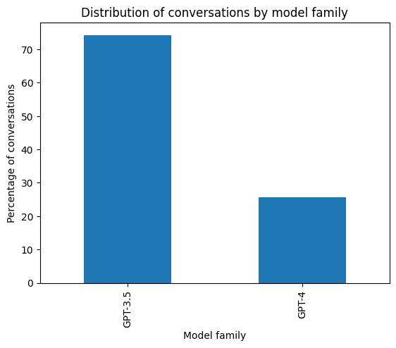
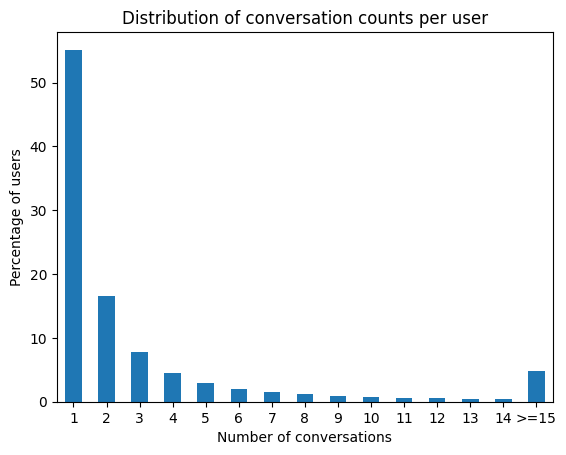
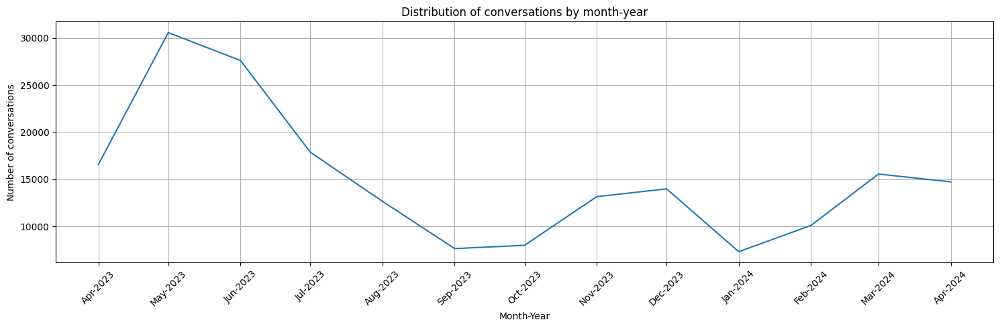
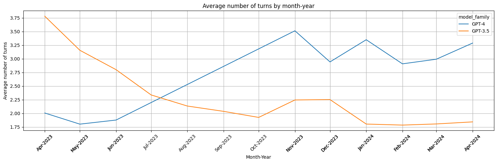
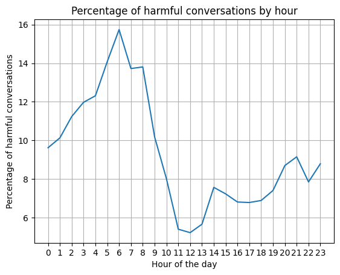

# Distribution analysis:
- Distribution of conversation by GPT model

- Distribution of turns by GPT model family
- Distribution of conversation counts per user


# Peak  conversation time for different regions
- Usage traffic over the day for different day of the week
- Usage traffic over the day for different region

# Top countries with highest percentage of repeat users

# Do engagement patterns differ between desktop and mobile users, i.e., avg turn per conversation different between desktop and mobile?

# Engagement metrics evolve over time?
- Does any day have noticeable more/fewer conversations than other?

- Distribution of conversations by month/year:


- Average number of turns by month/year of 2 GPT model families:


# Harmful conversation patterns
- Relation between harmful conversation and the time of the day

```
4 to 8 am:
+--------------------+-----+
|        harmful_flag|count|
+--------------------+-----+
|              sexual| 9075|
|            violence| 2875|
|          harassment| 1421|
|                hate|  262|
|harassment_threat...|  206|
|harassment/threat...|  206|
|    violence/graphic|  203|

20 to 23:
+--------------------+-----+
|        harmful_flag|count|
+--------------------+-----+
|              sexual|12789|
|            violence| 4401|
|          harassment| 3224|
|                hate|  631|
|harassment_threat...|  513|
|harassment/threat...|  513|
|    violence/graphic|  281|
```

```
+--------------------+-----+-------------------+
|        harmful_flag|count|         percentage|
+--------------------+-----+-------------------+
|              sexual| 9075|  75.04961958319551|
|            violence| 2875|  23.77605028117764|
|          harassment| 1421| 11.751571286801191|
|                hate|  262| 2.1667217995368837|
|harassment_threat...|  206| 1.7036056897122065|
|harassment/threat...|  206| 1.7036056897122065|
|    violence/graphic|  203|  1.678795898114456|
|    violence_graphic|  203|  1.678795898114456|
```

```
+--------------------+-----+-------------------+
|        harmful_flag|count|         percentage|
+--------------------+-----+-------------------+
|              sexual|12789|  70.04984389549213|
|            violence| 4401|  24.10582242427562|
|          harassment| 3224| 17.658980117215314|
|                hate|  631|  3.456208577531906|
|harassment_threat...|  513| 2.8098811414799805|
|harassment/threat...|  513| 2.8098811414799805|
|    violence/graphic|  281| 1.5391356739880595|
|    violence_graphic|  281| 1.5391356739880595|
```
- Harmful conversation patterns on different days of the week

- Percentage of harmful conversation between different model

- Percentage of **generated** harmful messages between different models
    + Between 2 GPT family
    + Between different models in lymsys chat

